## Motivation
Two-factor authentication is becoming more and more of standard operating proceedure for large orginizations. Oregon State University is no different and two-factor authentication will soon be manditory. Many of you are accustomed to using Duo to authenticate when logging into your email or Canvas. 

What some of you may not have realized is that two-factor authentication is now required for logging into Flip. This can cause problems with people who are not using a terminal to access the school servers as there is an additional prompt that requires a response. This is of particular inconvience to those using FTP programs. 

Below are guides to help streamline logging onto Flip without the need of involving Duo.

* [Windows Guide](#windows-guide)
* [MacOS Guide](#macos-guide)

## Windows Guide
For this you will need:

* PuTTY Key Generator - a program to generate ssh private and public keys (download [here](http://the.earth.li/~sgtatham/putty/latest/x86/puttygen.exe))
* PuTTY (available [here](https://www.chiark.greenend.org.uk/~sgtatham/putty/latest.html))
* Filezilla (available [here](https://filezilla-project.org/))

#### Steps
1. Open up PuTTY Key Generator, click "Generate," and follow the on-screen instructions
2. Once the key is generated, you will need to save the public key

   

   Save it to a location you will be able to easily find it and name it `id_rsa.pub`
   
3. Now you need to save the private key

   
   
   Ignore the warning about the passcode. Save it to the same location as before and name it `id_rsa.ppk`
   
4. Using PuTTY, log onto Flip and enter your password when prompted
5. You will be presented with a Duo two-factor prompt. Enter `1` and press enter. This will send a request to your Duo Mobile app which you will need to accept
   
   
   
6. You are now logged onto Flip
7. Use your favorite command text editor (mine is emacs) to open up `~/.ssh/authorized_keys` which should be an empty file. If it does not exist, create it
8. Now, locate the public key file you saved and open it with notepad and copy the key as shown in the image below

   

9. Back in the editor on Flip, type `ssh-rsa` followed by a space and the paste the copied public key and save the changes

   

10. Back in PuTTY, you want to create a Saved Session you have not done so already

  1. In Host Name entere `your_username@access.engr.oregonstate.edu`
     
	 
	 
  2. Below in the Saved Sessions field enter `flip` and click Save
  
     
	 
  3. Click Connect->SSH->Auth on the sidebar
  
     
	 
  4. On this screen, Browse to the location of your private key file: id_rsa.ppk. Now click the Open Button at the bottom
  
     
	 
  5. You should not be logged onto Flip without needing to provide a password OR two-factor authorization
  
     
 
11. Now we need to set up FileZilla
  1. Open Filzilla and go to File->Site Manager
     
	 
	 
  2. Create a New Site and name it `flip`
   
     
	 
  3. To the right in the General Tab, Select `SFTP` for the Protocol and enter the Host as `access.engr.oregonstate.edu`
  
     
	 
  4. For Logon Type select `Key file`, enter your username for User, and then browse to the location of your `id_rsa.ppk' file.
 
     
	 
  5. Click Connect at the bottom and you should now be connected to Flip without the need of two-factor authentication!
  
## MacOS Guide
For this you will need:

* Access to a terminal
* Cyberduck (available [here](https://cyberduck.io/))

### Steps

1. Open up your terminal application and type `ssh-keygen -t rsa`

   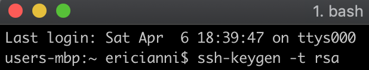

2. You will then be asked to choose a save location for the keys. You can choose the default by pressing `enter`. Then hit `enter` two more times to skip creating a passcode

   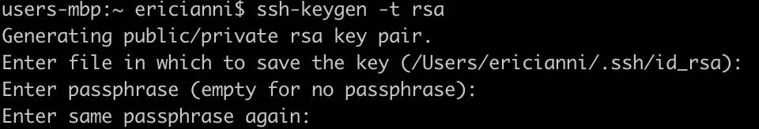

3. Once the key is generated you should see something similar to the image below. Please ensure you remember where your `id_rsa` file is saved

   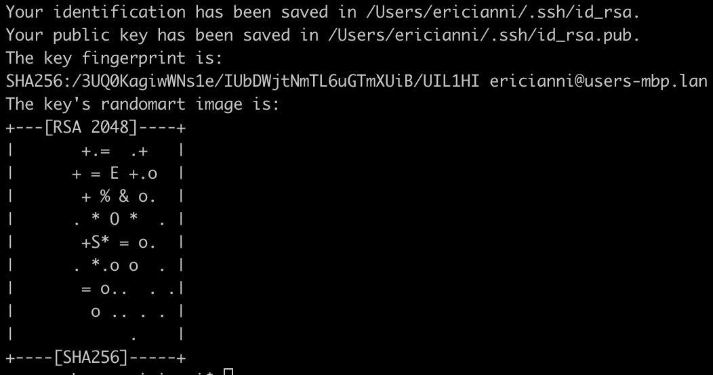
   
4. Still in the terminal, type `ssh-copy-id your_username@access.engr.oregonstate.edu`. This will publish your public key to Flip

   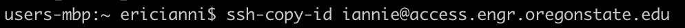

5. When prompted enter your password

   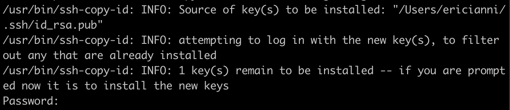

6. You should now see the two-factor Duo authentication. Enter `1` to send a push to your Mobile Duo app

   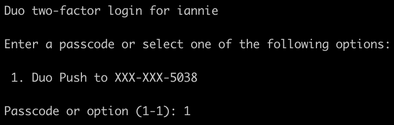
   
7. Now you need to create a config file in the directory where you have your saved keys. If you used the default save location you can do this by entering `touch ~/.ssh/config`

   
   
8. Once created, you can use your favorite text edit (mine is emacs) to open the file

   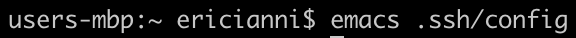
   
9. To this file you need to add three lines
   
   1. `Host flip` - where `flip` is the name of the shortcut you want to create
   2. `HostName access.engr.oregonstate.edu` 
   3. `User your_username`
   
   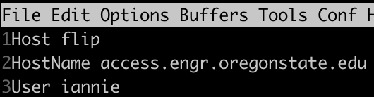
   
10. To log into Flip using the key simply type `ssh flip` and you will connect without having to enter a password or do two-factor authentication

   
   
11. Now it is time to configure Cyberduck for FTP

    1. Open up Cyberduck and click the Open Connection button
	
	   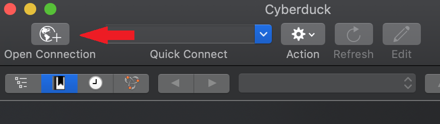
	   
	2. You need to select the connection type and change it to `SFTP`
	
	   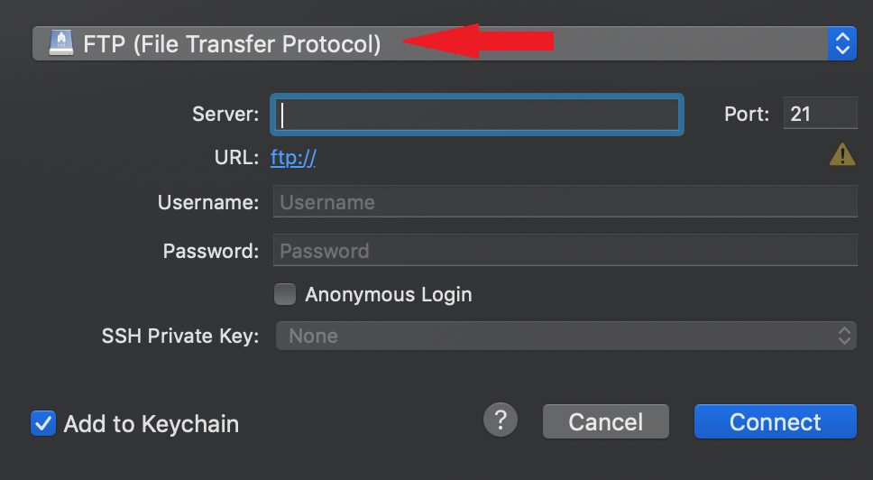
	   
	3. Now you must enter your username
	
	   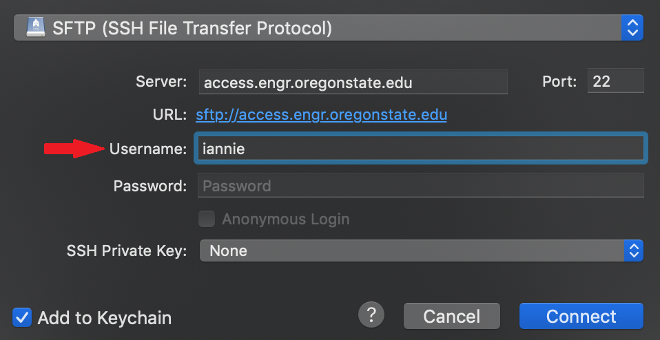
	
	4. Do not enter a password and change SSH Private Key from `none` to the location of your `id_rsa` file. If you followed the default settings it should already be listed without needing to browse
	
	   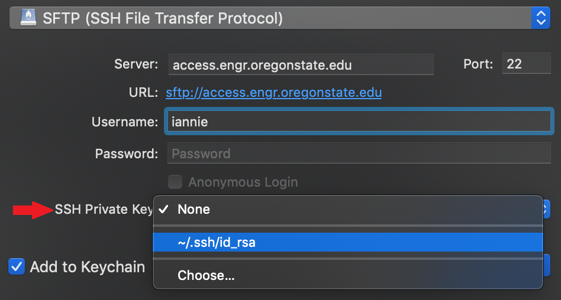
	   
	5. Finally click the Connect button and you will be logged into Flip without the need for a password or 2-factor authentication
	
	   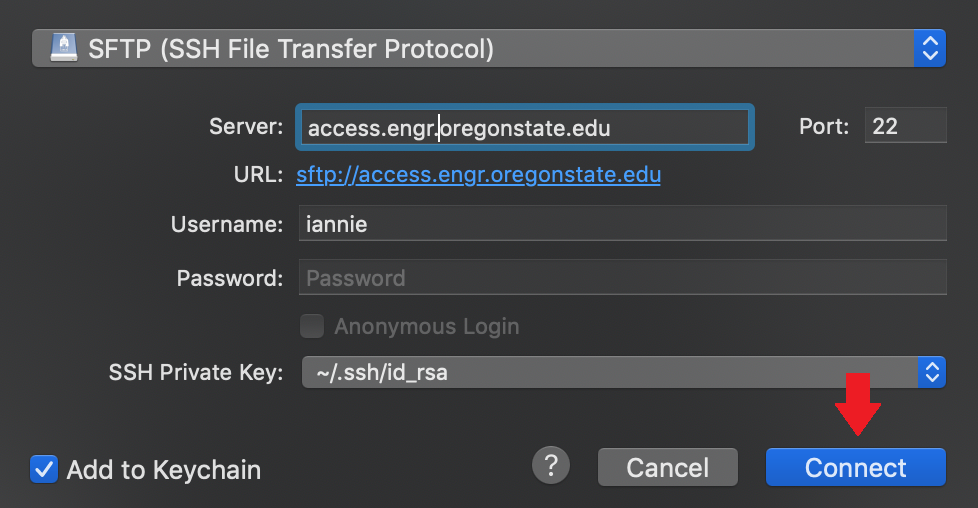

## Linux Guide
